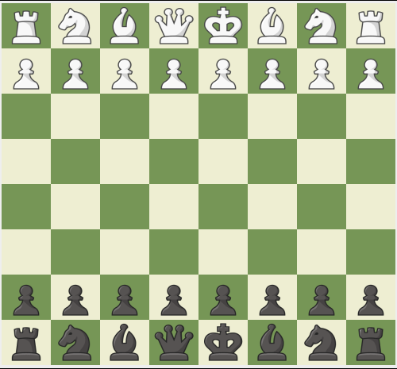
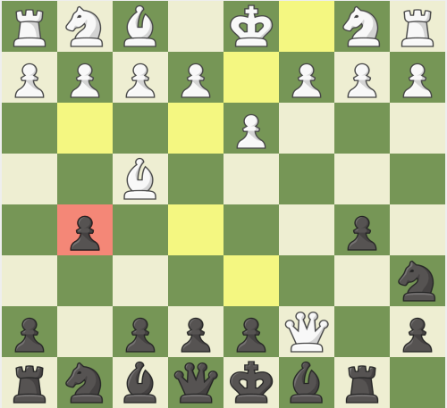

# Chess

This is a sample chess game implementation with the basic moves for all pieces on the board with a graphical interface using **Java Swing**, and powered with stockfish.

  
   

## Prerequisite
- ``sudo apt install stockfish`` to install stockfish on your computer.

## Upcoming Features
- En passant capture
- Castling (kingside & queenside)
- Pawn promotion with piece selection
- Checkmate and stalemate detection
- Move history and game saving

## Contribute:
If you'd like to contribute with ideas or corrections, please create a pull request and I'll review it.